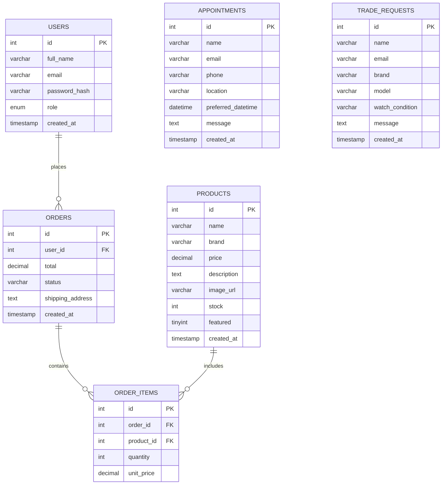

```mermaid
erDiagram
    USERS ||--o{ ORDERS : places
    ORDERS ||--o{ ORDER_ITEMS : contains
    PRODUCTS ||--o{ ORDER_ITEMS : includes

    USERS {
        int id PK
        varchar full_name
        varchar email
        varchar password_hash
        enum role
        timestamp created_at
    }

    ORDERS {
        int id PK
        int user_id FK
        decimal total
        varchar status
        text shipping_address
        timestamp created_at
    }

    ORDER_ITEMS {
        int id PK
        int order_id FK
        int product_id FK
        int quantity
        decimal unit_price
    }

    PRODUCTS {
        int id PK
        varchar name
        varchar brand
        decimal price
        text description
        varchar image_url
        int stock
        tinyint featured
        timestamp created_at
    }

    APPOINTMENTS {
        int id PK
        varchar name
        varchar email
        varchar phone
        varchar location
        datetime preferred_datetime
        text message
        timestamp created_at
    }

    TRADE_REQUESTS {
        int id PK
        varchar name
        varchar email
        varchar brand
        varchar model
        varchar watch_condition
        text message
        timestamp created_at
    }
```
